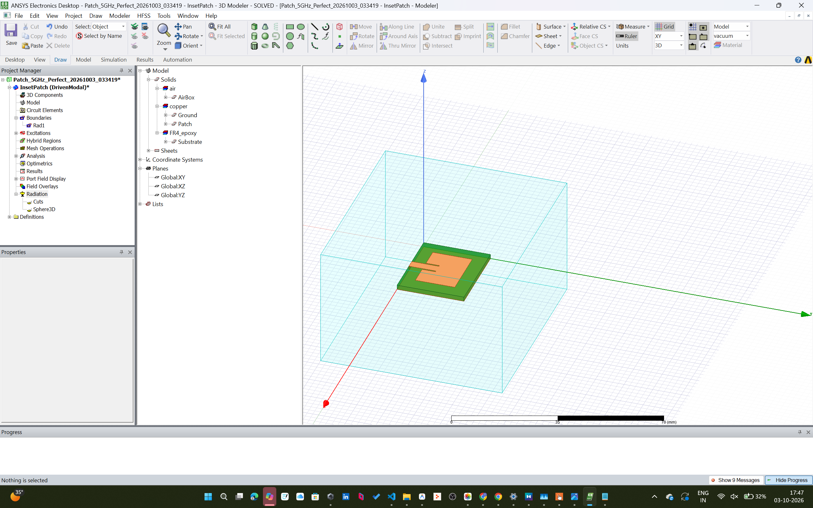
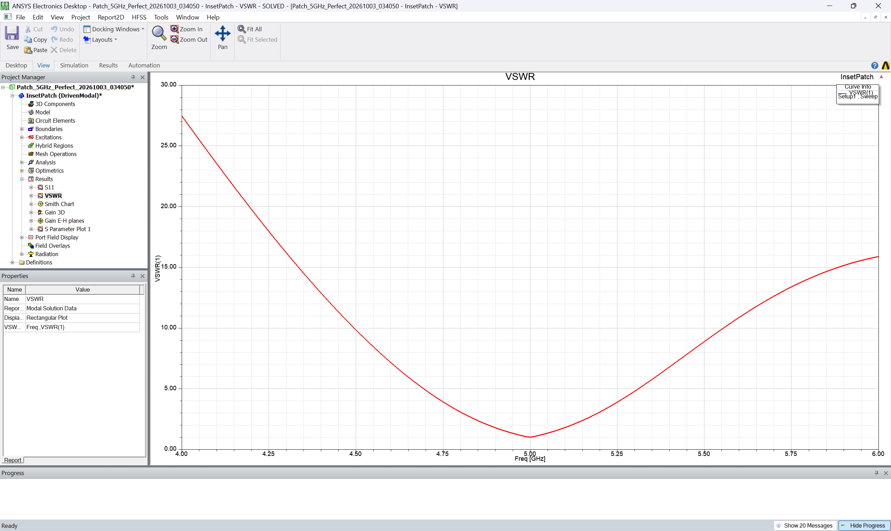
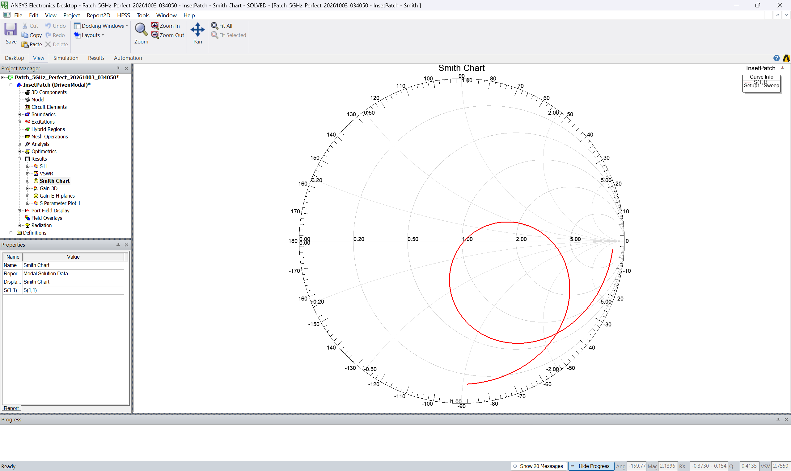
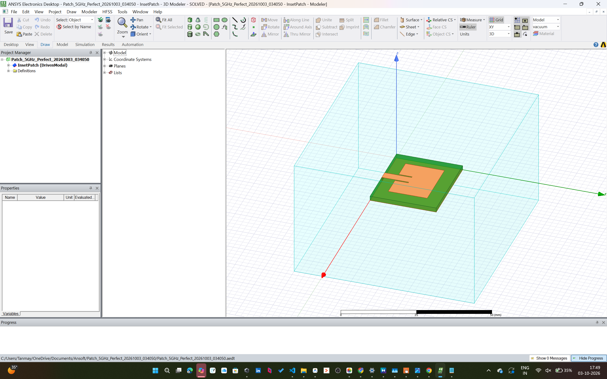

# 5 GHz Inset-Fed Microstrip Patch Antenna
### IEEE Techblocks RF and Antenna Simulation — Final Capstone Project

**Author:** Tanmay Kumar (NJG2610272)  
**Tools:** Ansys HFSS (Electronics Desktop), Python  

---

## Project Overview

Design and simulation of a 5 GHz rectangular inset-fed microstrip patch antenna designed on FR-4 substrate and simulated using Ansys HFSS.

The antenna is designed for 5 GHz Wi-Fi / C-band applications with a 50-ohm microstrip line feed. An inset feed notch is used to match the antenna input impedance directly to 50 ohms without an external matching network.

---

## Design Specifications

* **Operating Frequency ($f_0$):** 5.0 GHz
* **Substrate:** FR-4 Epoxy ($\varepsilon_r = 4.4$, $\tan\delta = 0.02$)
* **Substrate Thickness ($h$):** 1.6 mm
* **Copper Cladding ($h_m$):** 0.035 mm (1 oz copper)
* **Target Input Impedance:** 50 $\Omega$

---

## Formulas & Dimensions

### 1. Patch Width ($W$)
$$W = \frac{c}{2 f_0} \sqrt{\frac{2}{\varepsilon_r + 1}} = 18.2574\text{ mm}$$

### 2. Effective Permittivity ($\varepsilon_{\text{eff}}$)
$$\varepsilon_{\text{eff}} = \frac{\varepsilon_r + 1}{2} + \frac{\varepsilon_r - 1}{2} \left[1 + 12 \left(\frac{h}{W}\right)\right]^{-1/2} = 3.8868$$

### 3. Fringing Length Extension ($\Delta L$)
$$\Delta L = 0.412 h \frac{(\varepsilon_{\text{eff}} + 0.3) \left(\frac{W}{h} + 0.264\right)}{(\varepsilon_{\text{eff}} - 0.258) \left(\frac{W}{h} + 0.8\right)} = 0.7480\text{ mm}$$

### 4. Patch Length ($L$)
$$L_{\text{eff}} = \frac{c}{2 f_0 \sqrt{\varepsilon_{\text{eff}}}} = 15.2168\text{ mm}$$

$$L = L_{\text{eff}} - 2 \Delta L = 13.6629\text{ mm}$$

### 5. 50-Ohm Feedline Width ($W_f$)
$$W_f = 3.0590\text{ mm}$$

### 6. Inset Feed Depth ($y_0$) & Notch Gap ($g$)
$$R_{\text{in}}(y_0) = R_{\text{in}}(0) \cos^2\left(\frac{\pi y_0}{L}\right) = 50\ \Omega \implies y_0 = 4.6689\text{ mm}$$
$$g = 0.5000\text{ mm}$$

### 7. Substrate & Ground Plane Dimensions ($W_s, L_s$)
$$W_s = W + 6 h = 27.8574\text{ mm}$$
$$L_s = L + 6 h = 23.2629\text{ mm}$$

---

## Simulation Results

| Parameter | Value |
| :--- | :--- |
| **Resonant Frequency** | 5.00 GHz |
| **Return Loss ($S_{11}$)** | -37.52 dB |
| **VSWR** | 1.03 : 1 |
| **Peak Gain** | 4.80 dBi |
| **-10 dB Bandwidth** | ~300 MHz (4.85 GHz – 5.15 GHz) |
| **Input Impedance** | ~49.8 + j0.2 $\Omega$ |

---

## Plots & HFSS Model

### 1. 3D Model in HFSS
Model includes the FR-4 substrate, ground plane, copper patch with inset notch, lumped port, and radiation air box.

### 2. Return Loss ($S_{11}$)
$S_{11}$ plot from 4.0 GHz to 6.0 GHz showing resonance at 5.0 GHz with a dip of -37.52 dB.

### 3. VSWR
VSWR curve showing 1.03 at 5.0 GHz.

### 4. Smith Chart
Impedance locus passing through the center of the Smith chart (50 ohms).

### 5. 3D Radiation Pattern
Broadside radiation pattern with peak realized gain of 4.8 dBi.

### 6. Modeler Perspective
Close-up of the microstrip feedline and inset cutouts.

---

## Repository Files

* `models/5ghz_inset_patch.aedt` - Ansys HFSS simulation project file
* `results/` - Exported plots and screenshots from HFSS
* `scripts/calculate_dimensions.py` - Python script to compute patch parameters
* `final capstone project/` - Original workshop folder
