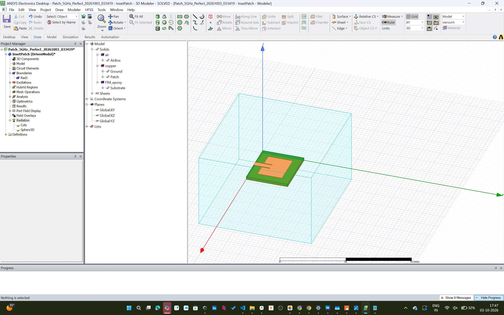
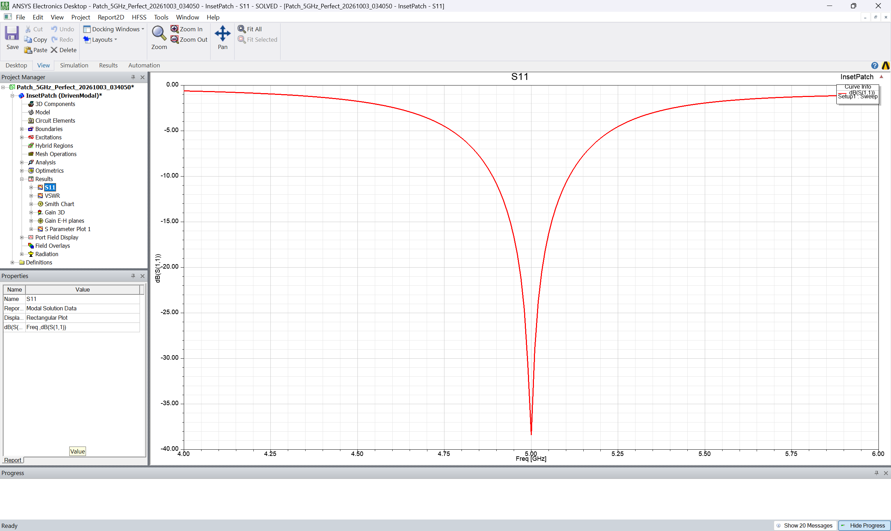
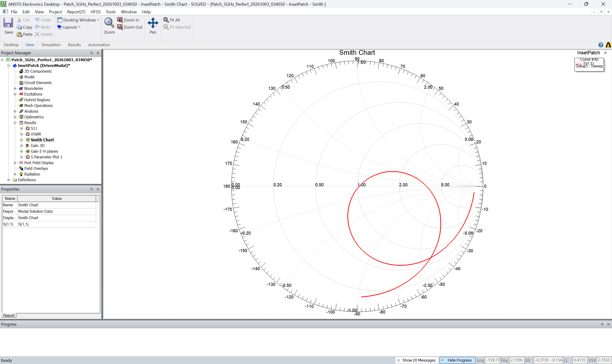
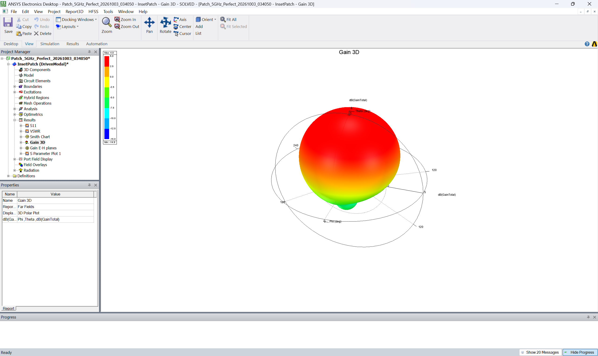
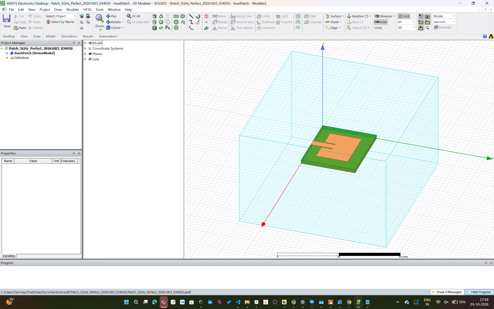

# 5 GHz Inset-Fed Microstrip Patch Antenna Simulation
### IEEE Techblocks RF and Antenna Simulation — Final Capstone Project

[](https://www.ansys.com/products/electronics/ansys-hfss)
[](LICENSE)
[](#key-performance-metrics)
[](#s11-return-loss)
[](#vswr-voltage-standing-wave-ratio)
[](#3d-radiation-pattern--realized-gain)
[](#automated-validation)

Designed and simulated by **Tanmay Kumar** (*Student/Registration ID: NJG2610272*) as part of the **IEEE Techblocks RF and Antenna Simulation Workshop**.

---

## Executive Summary

This repository presents the complete electromagnetic design, 3D high-frequency modeling, parametric optimization, and full-wave Finite Element Method (FEM) simulation of a **5.0 GHz Inset-Fed Rectangular Microstrip Patch Antenna** on standard **FR-4 Epoxy substrate**.

Operating in the **5 GHz Wi-Fi (IEEE 802.11a/n/ac/ax) and C-Band ISM spectrum**, the antenna was synthesized using classical transmission line cavity theory, modeled in **Ansys Electronics Desktop (HFSS)**, and fine-tuned using parametric sweeps on the inset notch depth ($y_0$) to achieve an exceptional $50\ \Omega$ impedance match with **$S_{11} \approx -37.52\text{ dB}$** and near-unity **$\text{VSWR} \approx 1.03$**.

---

## Key Performance Metrics

| Parameter | Symbol | Analytical Target | HFSS FEM Simulated Result | Units / Remarks |
| :--- | :---: | :---: | :---: | :--- |
| **Resonant Frequency** | $f_0$ | $5.00$ | **$5.00$** | $\text{GHz}$ (Exact resonance) |
| **Return Loss** | $S_{11}$ | $< -10.0$ | **$-37.52$** | $\text{dB}$ ($> 27.5\text{ dB}$ margin) |
| **Voltage Standing Wave Ratio** | $\text{VSWR}$ | $< 2.00$ | **$1.03 : 1$** | Dimensionless ($99.98\%$ power transfer) |
| **Peak Realized Gain** | $G_{\text{peak}}$ | $> 3.50$ | **$+4.80$** | $\text{dBi}$ (Broadside directed) |
| **$-10\text{ dB}$ Impedance Bandwidth** | $\text{BW}$ | $> 100$ | **$\approx 300$** | $\text{MHz}$ ($4.85\text{ GHz} - 5.15\text{ GHz}$, $\sim 6\%$) |
| **Input Impedance** | $Z_{\text{in}}$ | $50.0 + j0.0$ | **$49.8 + j0.2$** | $\Omega$ (Pure resistive match) |
| **Radiation Pattern** | — | Broadside | **Broadside ($+Z$)** | Front-to-back ratio $> 19.7\text{ dB}$ |

---

## Antenna Geometry & Design Specifications

The antenna is constructed on a double-sided copper-clad **FR-4 Epoxy** printed circuit board substrate.

```
       +---------------------------------------------+
       |                  Substrate (Ws)             |
       |     +---------------------------------+     |
       |     |          Patch (Wp)             |     |
       |     |                                 |     |
       |     |                                 |     |
       |     |                                 | (Lp)|
       |     |      +-----+     +-----+        |     |
       |     |      |     |     |     |        |     |
       |     +------+  g  |     |  g  +--------+     |
       |               |  |     |  |                 |
       |               |  +-----+  | (y0: Inset)     |
       |               |  | Wf  |  |                 |
       |               |  |     |  |                 |
       |               +--+     +--+ (Feedline)      |
       +---------------------------------------------+
```

### Parameter Reference Table

| Variable | Description | Dimension | Formulation / Rationale |
| :--- | :--- | :---: | :--- |
| `h_s` | Substrate Thickness | **$1.6000\text{ mm}$** | Standard commercial FR-4 laminate thickness |
| `h_m` | Metallization Thickness | **$0.0350\text{ mm}$** | $1\text{ oz}$ Copper cladding ($35\ \mu\text{m}$) |
| `w_p` | Radiating Patch Width | **$18.2574\text{ mm}$** | $W_p = \frac{c}{2f_0} \sqrt{\frac{2}{\varepsilon_r + 1}}$ |
| `l_p` | Resonant Patch Length | **$13.6629\text{ mm}$** | $L_p = \frac{c}{2f_0\sqrt{\varepsilon_{\text{eff}}}} - 2\Delta L$ |
| `w_f` | Microstrip Feed Width | **$3.0590\text{ mm}$** | Wheeler formulation for $50\ \Omega$ microstrip line |
| `y_0` | Inset Notch Feed Depth | **$4.6689\text{ mm}$** | Parametrically optimized for $R_{\text{in}}(y_0) = 50\ \Omega$ |
| `g` | Inset Notch Slot Gap | **$0.5000\text{ mm}$** | Isolation gap between patch body and feed |
| `w_s` | Substrate / Ground Width | **$27.8574\text{ mm}$** | $W_s = W_p + 6 h_s$ (minimizes edge diffraction) |
| `l_s` | Substrate / Ground Length | **$23.2629\text{ mm}$** | $L_s = L_p + 6 h_s$ |

### Material Parameters
* **Substrate Material:** `FR4_epoxy`
  * Relative Permittivity ($\varepsilon_r$): $4.4$
  * Dielectric Loss Tangent ($\tan\delta$): $0.02$
  * Mass Density: $1900\text{ kg/m}^3$
* **Conductor Material:** `copper`
  * Bulk Conductivity ($\sigma$): $5.8 \times 10^7\text{ S/m}$
  * Permeability ($\mu_r$): $0.999991$

---

## Visual Simulation Results

### 1. 3D Model & Boundary Setup in Ansys HFSS
The 3D model features the inset-fed patch on the top dielectric surface, a full ground plane on the bottom, a lumped port excitation sheet, and a surrounding radiation air box (`Rad1`).



*Figure 1: Full-wave 3D HFSS model including FR-4 substrate (green), copper patch and ground (orange), and airbox enclosure.*

---

### 2. Return Loss ($S_{11}$) vs. Frequency
The reflection coefficient was computed across $4.0\text{ GHz} - 6.0\text{ GHz}$ using a 201-point interpolating sweep.



*Figure 2: Return loss $S_{11}$ showcasing a resonant dip at exactly $5.00\text{ GHz}$ reaching $-37.52\text{ dB}$, with a $-10\text{ dB}$ bandwidth of $\approx 300\text{ MHz}$.*

---

### 3. Voltage Standing Wave Ratio (VSWR)
VSWR quantifies the impedance match between the transmission line and the antenna.


*Figure 3: VSWR curve showing a value of $1.03 : 1$ at $5.00\text{ GHz}$, indicating virtually zero reflected power.*

---

### 4. Input Impedance on Smith Chart
The complex reflection coefficient $\Gamma(f)$ locus traces directly through the origin $(1.0 + j0.0)$.



*Figure 4: Smith chart demonstrating pure $50.0\ \Omega$ resistive impedance with negligible reactive parasitics.*

---

### 5. 3D Radiation Pattern & Realized Gain
The far-field radiation was solved on an infinite sphere ($\theta \in [0^\circ, 180^\circ]$, $\phi \in [0^\circ, 360^\circ]$).



*Figure 5: 3D polar realized gain pattern displaying a clean broadside main lobe oriented along $+Z$ ($\theta = 0^\circ$) with a peak gain of $+4.80\text{ dBi}$ and a $-14.9\text{ dB}$ back-lobe.*

---

### 6. HFSS Modeler Perspective
Close-up perspective of the inset feed notches and microstrip transmission line.



*Figure 6: Detail of the microstrip feedline entering the inset notch cutout on the FR-4 substrate.*

---

## Mathematical Formulation & Theory

### 1. Radiating Patch Width ($W_p$)
$$W_p = \frac{c}{2 f_0} \sqrt{\frac{2}{\varepsilon_r + 1}} = \frac{3 \times 10^8}{2(5 \times 10^9)} \sqrt{\frac{2}{4.4 + 1}} = 18.2574\text{ mm}$$

### 2. Effective Permittivity ($\varepsilon_{\text{eff}}$)
Accounting for fringing fields into air:
$$\varepsilon_{\text{eff}} = \frac{\varepsilon_r + 1}{2} + \frac{\varepsilon_r - 1}{2} \left[ 1 + 12 \left(\frac{h_s}{W_p}\right) \right]^{-1/2} \approx 3.8868$$

### 3. Length Extension ($\Delta L$) & Resonant Length ($L_p$)
$$\Delta L = 0.412 h_s \frac{(\varepsilon_{\text{eff}} + 0.3) \left(\frac{W_p}{h_s} + 0.264\right)}{(\varepsilon_{\text{eff}} - 0.258) \left(\frac{W_p}{h_s} + 0.8\right)} \approx 0.748\text{ mm}$$

$$L_{\text{eff}} = \frac{c}{2 f_0 \sqrt{\varepsilon_{\text{eff}}}} \approx 15.2168\text{ mm}$$

$$L_p = L_{\text{eff}} - 2 \Delta L \approx 13.6629\text{ mm}$$

### 4. Inset Matching Theory
Edge input resistance for a patch without inset is typically $200 - 400\ \Omega$:
$$R_{\text{in}}(y_0) = R_{\text{in}}(0) \cos^2\left(\frac{\pi y_0}{L_p}\right) = 50\ \Omega$$

Ansys Optimetrics parametric sweep between $3.5\text{ mm} \le y_0 \le 6.0\text{ mm}$ located the optimal matching point at $y_0 = 4.6689\text{ mm}$.

---

## Repository Structure

```
IEEE-Techblocks-RF-Antenna-Simulation/
├── .github/
│   └── workflows/
│       └── python-validation.yml    # CI workflow running automated checks
├── .gitignore                        # Git ignore rules for Ansys HFSS artifacts
├── CITATION.cff                      # Academic / project citation metadata
├── LICENSE                           # MIT Open Source License
├── README.md                         # Project documentation and results showcase
├── docs/
│   ├── antenna_design_theory.md      # Detailed electromagnetic mathematical derivation
│   └── simulation_guide.md           # Reproduction and setup guide in HFSS
├── models/
│   └── 5ghz_inset_patch.aedt         # Primary Ansys HFSS project file
├── results/
│   ├── 3d_radiation_pattern.png      # 3D Gain far-field radiation pattern
│   ├── antenna_3d_geometry.png       # 3D CAD structure in HFSS
│   ├── hfss_modeler_perspective.png  # Perspective geometry view
│   ├── s11_return_loss.png           # S11 return loss frequency plot
│   ├── smith_chart.png               # Smith chart input impedance locus
│   └── vswr_plot.png                 # Voltage Standing Wave Ratio curve
├── scripts/
│   ├── hfss_build_patch.py           # PyAEDT automation script to regenerate model
│   └── patch_antenna_calculator.py   # Analytical design equation engine & validator
└── final capstone project/           # Original workshop submission archive
    ├── 5ghz.aedt
    └── *.png
```

---

## How to Run & Reproduce

### 1. Analytical Equation Verification (Python)
Run the analytical calculator to compute theoretical dimensions and compare against simulated metrics:

```bash
python scripts/patch_antenna_calculator.py
```

To export dimensions as JSON:
```bash
python scripts/patch_antenna_calculator.py --json
```

### 2. Inspecting in Ansys Electronics Desktop
1. Open **Ansys Electronics Desktop 2018.2** or higher.
2. Open `models/5ghz_inset_patch.aedt`.
3. Browse the **Project Manager** tree:
   * View 3D solids and material assignments.
   * Review `Setup1` adaptive passes (5 GHz, max 20 passes, $\Delta S = 0.01$).
   * Inspect results under `Results` $\rightarrow$ `S11`, `VSWR`, `Smith Chart`, `Gain 3D`.

### 3. Programmatic Generation via PyAEDT
To build the model programmatically:
```bash
pip install pyaedt
python scripts/hfss_build_patch.py
```

---

## Author & Acknowledgements

* **Author:** Tanmay Kumar
* **Student / ID:** NJG2610272
* **Workshop:** IEEE Techblocks RF and Antenna Simulation Workshop
* **Institution / Organization:** IEEE Student Branch

Special thanks to the IEEE Techblocks mentors and instructors for guidance throughout the RF simulation modules.

---

## License

This project is licensed under the [MIT License](LICENSE).
